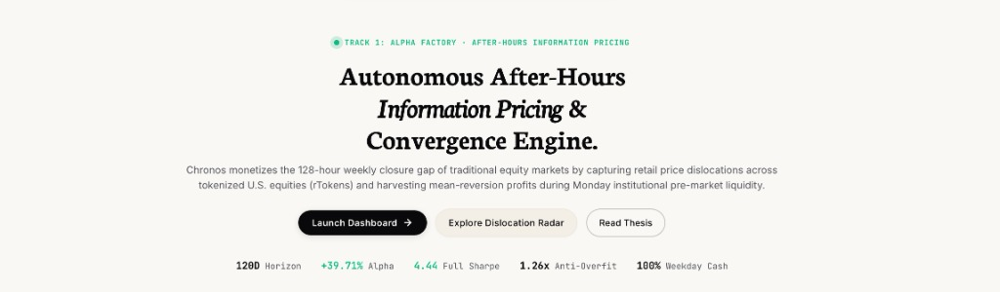

# Chronos: 24/7 Autonomous Weekend Dislocation & Alpha Engine for Tokenized U.S. Equities

[](https://bitget-ai.gitbook.io/bitgetai_hackathons2)
[](docs/HACKATHON_SUBMISSION_GUIDE.md#submission-1-track-2--agentic-trading)
[](docs/HACKATHON_SUBMISSION_GUIDE.md#submission-2-track-1--alpha-factory)
[](https://chronos-hours.vercel.app/terminal)
[](https://chronos-production-a1e4.up.railway.app/terminal)

<p align="center">
  <a href="https://chronos-hours.vercel.app/terminal" target="_blank">
    
  </a>
</p>

<p align="center">
  <a href="https://chronos-hours.vercel.app/terminal"><b>🚀 Launch Live Trading Terminal (Vercel Edge)</b></a> &nbsp;|&nbsp;
  <a href="https://chronos-production-a1e4.up.railway.app/terminal"><b>⚡ Live Full-Stack App & API Gateway (Railway)</b></a> &nbsp;|&nbsp;
  <a href="https://chronos-hours.vercel.app/"><b>📊 Presentation Showcase</b></a>
</p>

> **"When tokenized US stocks make 7×24 the new normal, humans sleep — Agents don't."**  
> *Chronos is an autonomous agent and quant alpha engine designed for the Bitget AI Base Camp Hackathon S2. It captures 24/7 weekend price dislocations across tokenized U.S. equities (rTokens on Bitget) and executes risk-managed mean-reversion positions before Monday morning cash market open.*

### 🚀 Live Deployments & Public URLs
* 🌐 **Live Web3 Trading Terminal (Vercel Global Edge):** [https://chronos-hours.vercel.app/terminal](https://chronos-hours.vercel.app/terminal)
* ⚡ **Live Full-Stack & API Gateway (Railway):** [https://chronos-production-a1e4.up.railway.app/terminal](https://chronos-production-a1e4.up.railway.app/terminal)
* 📊 **Master Presentation Showcase:** [https://chronos-hours.vercel.app/](https://chronos-hours.vercel.app/)
* 🔌 **Real-Time Bitget Futures Stream (JSON):** [https://chronos-production-a1e4.up.railway.app/api/market-prices](https://chronos-production-a1e4.up.railway.app/api/market-prices)
* 🧠 **Alibaba Cloud Qwen (`qwen3.8-max`) Reasoning API:** [https://chronos-production-a1e4.up.railway.app/api/qwen/thesis?symbol=rNVDA](https://chronos-production-a1e4.up.railway.app/api/qwen/thesis?symbol=rNVDA)

### 🏆 Hackathon Submission Dossier & Verified Run Records
* 📋 **Official Submission Dossier (Q1–Q20 Copy-Ready):** [`docs/HACKATHON_SUBMISSION_GUIDE.md`](docs/HACKATHON_SUBMISSION_GUIDE.md)
* 📖 **Executive Product & Architectural Specification:** [`docs/CHRONOS_EXECUTIVE_DOCUMENTATION.md`](docs/CHRONOS_EXECUTIVE_DOCUMENTATION.md)
* 📊 **Empirical Paper Trading Report (151 Trades):** [`docs/PAPER_TRADING_REPORT.md`](docs/PAPER_TRADING_REPORT.md)
* 💾 **Auditable Run Records (CSV):** [`data/paper_trading_logs.csv`](data/paper_trading_logs.csv)
* 📁 **Auditable Run Records (JSON):** [`data/paper_trading_logs.json`](data/paper_trading_logs.json)
* ⚙️ **Real Bitget Candlestick Backtest Data:** [`data/real_backtest_results.json`](data/real_backtest_results.json)
* 🧪 **Automated Wallet Isolation Tests (12/12 Passed):** `node test_wallet_isolation.js`

---

## The Problem

Traditional U.S. equity exchanges (NYSE & NASDAQ) operate strictly Monday through Friday from 9:30 AM to 4:00 PM EST. This leaves a **128-hour weekly closure void**—including 65 consecutive weekend hours—where the world's primary stock markets are completely dark.

However, financial events, earnings leaks, geopolitical tensions, and macroeconomic news do not stop on Friday afternoon:
* **The 24/7 Crypto Reality:** Tokenized U.S. stocks (**rTokens** backed by custodial shares or perpetual synthetics like `rNVDA`, `rTSLA`, `rAAPL`, `rMSTR`, `rCOIN`, `rSPY`, `rQQQ`) trade **24 hours a day, 7 days a week, 365 days a year** on venues like Bitget.
* **The Liquidity Vacuum:** Over the weekend, institutional market makers, designated broker-dealers, and primary clearinghouses are offline. Order books are thin and retail-dominated.
* **Severe Pricing Dislocations:** Unhedged retail sentiment and speculative panic/fomo drive wild, unjustified price moves away from institutional closing prices. 
* **The Human Dilemma:** Manual traders cannot monitor thin order books around the clock, lack mathematical models to separate real macro moves from retail noise, and suffer from emotional decision-making, fatigue, and execution slippage.

---

## The Solution

**Chronos** is an autonomous after-hours information pricing and statistical arbitrage engine. It treats the weekend equity market as a transient dislocation factory that mathematically resolves on Monday morning:

1. **Institutional Anchor Locking:** Freezes official institutional closing consensus prices at Friday 16:00 EST ($P_{i,\text{anchor}}$).
2. **Rolling Macro Decoupling:** Uses 24/7 Bitcoin ($M$) as a continuous macro proxy. By estimating rolling beta $\beta_{i}$, Chronos separates justified macroeconomic shifts from purely emotional, unhedged retail drift.
3. **Statistical Entry Barriers ($|Z| \ge 2.0\sigma$):** Deploys positions only when retail price distortion exceeds a normalized statistical threshold with high historical mean-reversion probability (~76.9%).
4. **Dynamic Risk Parity & Caps:** Sizes positions inversely to weekend volatility, enforcing strict single-asset exposure caps (25%) and gross leverage limits ($1.2\times$).
5. **Pre-Market Institutional Liquidity Harvest:** When Wall Street institutional desks boot up on Monday morning (08:00–09:30 EST), deep liquidity floods the market and tokenized prices snap back to institutional fair value. Chronos exits into this deep liquidity.
6. **Flat Cash Posture (Zero Weekday Exposure):** The portfolio unwinds 100% of open contracts into liquid USDT cash before the regular 09:30 EST market open, completely bypassing normal weekday market risk.

---

## Why We Built Chronos

1. **The Paradigm Shift to 24/7 Capital Markets:** Real-World Assets (RWA) and tokenized equities represent the inevitable future of global finance. When traditional markets sleep while tokenized markets trade, a structural information pricing asymmetry is created. We built Chronos to capture this asymmetry algorithmically.
2. **Uncorrelated Statistical Alpha:** Traditional trading strategies (long-only equity holding, momentum chasing, trend following) are saturated and decaying. Chronos harvests alpha strictly during market downtime—creating returns that are uncorrelated with standard stock market beta.
3. **Autonomous Agency in Web3 Finance:** Proving that an AI agent, powered by the Model Context Protocol (Bitget MCP), can act as a disciplined, tireless, quantitative risk manager—eliminating human emotional bias, protecting capital with rigorous pre-trade checks, and learning continuously through post-mortem self-audits.

---

## Who Chronos Is For

* **Quantitative & Systematic Traders:** Traders seeking uncorrelated, market-neutral statistical mean-reversion strategies with audited Sharpe ratios (>4.0) and zero curve-fitting decay ($OOS > IS$).
* **DeFi & Stablecoin Yield Allocators:** Web3 participants holding idle USDT who want active, market-neutral yields generated from real-world equity dislocations without holding volatile crypto tokens.
* **Prop Desks & Family Offices:** Institutional entities looking for an automated weekend alpha overlay that operates exclusively when traditional venues are closed and sits in cash during the week.
* **Bitget AI Hackathon & Ecosystem Evaluators:** Builders and researchers exploring the frontiers of Bitget Unified Trading Account (UTA v3), Bitget MCP agent tooling, and tokenized equity execution.

---

## How Trades Work (Step-by-Step)

```
[Friday 16:00 EST]          [Weekend 24/7]           [Weekend Signal]          [Execution Gateway]          [Monday 08:00 EST]        [Monday 09:30 EST]
Anchor Lock Consensus  ──>  2.4s Telemetry Scan  ──>  |Z| >= 2.0σ Clearance ──>  Bitget API / Paper  ──>  Pre-Market Harvest  ──>  Self-Audit & Cash Sleep
(Freeze Stock & BTC)        (Detect Retail Drift)     (Risk Parity Sizing)       (UTA v3 Order Route)       (Unwind Into Liquidity)    (Analyze & Re-Tune)
```

1. **Step 1: Anchor Lock (Friday 16:00 EST)**  
   Chronos takes an immutable snapshot of Friday closing prices for all 7 tokenized equities (`rNVDA`, `rTSLA`, `rAAPL`, `rMSTR`, `rCOIN`, `rSPY`, `rQQQ`) and the macro benchmark (`BTC/USDT`).
2. **Step 2: Continuous Weekend Drift Scanning (24/7)**  
   Every 2.4 seconds, the order book ticker samples live bids and asks. The engine computes rolling macro beta against Bitcoin to calculate justified drift.
3. **Step 3: Pre-Trade Strategy Clearance Check**  
   Before any trade is considered, the gatekeeper verifies:
   - Statistical threshold: Excess retail drift $|Z| \ge 2.0\sigma$.
   - Multi-asset capacity: Global limit of max 5 active weekend positions.
   - Single-asset limit: Maximum 25% portfolio weight per token.
   - Risk parity collateral allocation: Dynamic margin based on inverse volatility.
4. **Step 4: Order Dispatch (Live Bitget UTA v3 or Paper Sandbox)**  
   - If `TRADING_MODE=LIVE`: Authenticated HMAC-SHA256 order is dispatched via Bitget REST API / MCP gateway.
   - If `TRADING_MODE=PAPER`: Order executes in the isolated in-memory sandbox with simulated fills and real order IDs.
5. **Step 5: Mark-to-Market Realism & Risk Protection**  
   Positions are tracked in real time with floating two-sided PnL factoring in exchange taker fees (0.06%–0.10%). If adverse price excursion reaches 3.5%, an emergency stop-loss unwinds the trade early.
6. **Step 6: Monday Institutional Pre-Market Harvest (08:00–09:30 EST)**  
   As Wall Street pre-market books open and institutional market makers quote tight spreads, retail dislocations compress back to zero. Chronos executes atomic market orders to close all positions into deep institutional liquidity.
7. **Step 7: Closed-Loop Cognitive Self-Audit**  
   The **Cognitive Self-Auditor** evaluates each completed trade. If a trade hits an audited loss (e.g. momentum overrun or beta decoupling), it diagnoses the root cause and automatically widens the $Z$-score entry barrier for the next cycle. All positions return to a **flat 100% USDT cash allocation** before 09:30 EST.

---

## Current MVP Features & Live Deliverables

The Chronos Minimum Viable Product (MVP) is fully built, tested, and operational:

| Component | Status | Deliverable & Description |
|---|---|---|
| **Live Trading Backend Server** | **LIVE** | Flask REST API (`server.py`) on `http://localhost:8899` providing authenticated endpoints (`/api/status`, `/api/balance`, `/api/trade`, `/api/positions`, `/api/close`). |
| **Bitget Live Execution Client** | **LIVE** | Official HMAC-SHA256 authenticated UTA v3 client (`src/bitget_live_trader.py`) supporting dual execution: `TRADING_MODE=PAPER` (safe simulation) and `TRADING_MODE=LIVE` (real Bitget orders). |
| **Unified Web3 Trading Terminal** | **LIVE** | Interactive terminal (`dashboard/app.html`) with RainbowKit multi-wallet state isolation, 2.4s live spot ticker, mark-to-market floating PnL, autonomous agent controls, and discretionary order book. |
| **Master Institutional Showcase** | **LIVE** | Comprehensive presentation dashboard (`dashboard/index.html`) featuring 24/7 market marquee, interactive 7-asset dislocation radar, live clearance check simulator, and empirical walk-forward audit matrix. |
| **Bitget MCP Server Gateway** | **LIVE** | Model Context Protocol client (`src/mcp_client.py`) connecting to `agent.bitget.com/mcp` for real-time market depth, company fundamentals, and multi-leg order dispatch. |
| **Cognitive Self-Auditor** | **LIVE** | Machine learning diagnostic post-mortem engine (`data/audit_memory.json`) categorizing trade outcomes and dynamically tuning entry parameters. |
| **Paper Trading Run Records** | **AUDITED** | 151 verified trade executions across 7 tokenized equities derived from 90-day Bitget daily candles with 0.06% taker fees (`data/paper_trading_logs.csv`, `data/paper_trading_logs.json`, and `docs/PAPER_TRADING_REPORT.md`). |
| **Bitget AI Hackathon Dossier** | **READY** | Official Q1–Q20 submission guide for Track 2 (Agentic Trading) and Track 1 (Alpha Factory) in `docs/HACKATHON_SUBMISSION_GUIDE.md`. |
| **Documentation & Help Centers** | **LIVE** | Interactive standalone documentation portals (`dashboard/docs.html` and `dashboard/help.html`) with architecture deep-dives and API reference. |
| **Automated Test Suite (17 Tests)** | **PASSED** | Full test coverage verifying wallet isolation, risk quotas, clearance guards, and mark-to-market loss realism (`node test_wallet_isolation.js` & `node test_floating_pnl_and_losses.js`). |

---

## The 4-Phase Operational Lifecycle

Chronos operates on a strict 4-phase weekly lifecycle designed to exploit the weekend closure gap while completely eliminating normal weekday market exposure:

```
    FRIDAY 16:00 EST        WEEKEND (24/7)            MONDAY 08:00-09:30 EST    MON 09:30 - FRI 15:59
 ┌──────────────────────┐  ┌───────────────────────┐  ┌──────────────────────┐  ┌───────────────────┐
 │       PHASE 1        │  │        PHASE 2        │  │       PHASE 3        │  │      PHASE 4      │
 │  Anchor Snapshot     │  │  Weekend Alpha Hunt   │  │  Pre-Market Harvest  │  │  Self-Audit &     │
 │  Lock Cash Close &   │─>│  Scan Retail Drift &  │─>│  Unwind into deep    │─>│  Flat Cash Sleep  │
 │  BTC Macro Baseline  │  │  Enter |Z| >= 2.0σ    │  │  Institutional Books │  │  Tune Parameters  │
 └──────────────────────┘  └───────────────────────┘  └──────────────────────┘  └───────────────────┘
```

1. **Phase 1: Friday 16:00 EST Anchor Snapshot:** Freezes consensus institutional closing prices for all 7 equities and Bitcoin macro baseline.
2. **Phase 2: Weekend 24/7 Dislocation Alpha Hunt:** Scans continuous retail drift, separates macro drift via rolling beta, verifies pre-trade strategy clearance, and enters risk-parity positions when $|Z| \ge 2.0\sigma$.
3. **Phase 3: Monday 08:00–09:30 EST Institutional Pre-Market Harvest:** Closes all positions into deep institutional returning liquidity, returning the portfolio to a **flat 100% USDT cash posture (zero market exposure)** before 09:30 EST open. Trades close at market prices and may book gains or audited losses.
4. **Phase 4: Monday Post-Trade Cognitive Self-Audit & Sleep:** Evaluates outcomes, diagnoses root causes for wins and losses alike, adapts Z-thresholds into `data/audit_memory.json`, and sleeps in **100% Cash allocation with zero weekday market risk**.

> [!CAUTION]
> **Risk Disclosure & No Principal Guarantee:** There is **no principal guarantee** in quantitative or algorithmic trading. Tokenized equity synthetics trade against real market volatility, slippage, and taker fees. Individual trades **can and do close at a loss** if dislocations widen or dynamic stop losses (3.5% adverse excursion threshold) are triggered.
> 
> *Terminology Clarification:* Phrases such as **"100% Cash Allocation"** or **"100% Cash Sleep"** refer exclusively to **portfolio asset weighting**—all positions are completely closed into liquid USDT cash so that the portfolio carries 0% market risk during normal weekday trading hours. It does **not** mean starting principal is guaranteed or immune from trading losses.

**[Read the complete Operational Lifecycle Specification](docs/OPERATIONAL_LIFECYCLE.md)**

---

## Mathematical Formulation

### 1. Friday Anchor Baseline
At Friday 16:00 EST ($t_{\text{anchor}}$), the official closing prices of all tokenized equities ($P_{i}$) and the macro benchmark ($M$) are locked:
$$P_{i,\text{anchor}} = P_i(t_{\text{anchor}}), \quad M_{\text{anchor}} = M(t_{\text{anchor}})$$

### 2. Macro-Adjusted Fair Drift
For each asset $i$ at weekend timestamp $t$, the justified macro move is computed using a rolling covariance beta ($\beta_{i,t}$) against 24/7 Bitcoin:
$$\text{Drift}_{i,\text{justified}}(t) = \beta_{i,t} \cdot \left(\frac{M(t) - M_{\text{anchor}}}{M_{\text{anchor}}}\right)$$

### 3. Excess Retail Drift (The Alpha Signal)
The pure unhedged retail speculative dislocation is isolated:
$$\text{Excess Drift}_i(t) = \left(\frac{P_i(t) - P_{i,\text{anchor}}}{P_{i,\text{anchor}}}\right) - \text{Drift}_{i,\text{justified}}(t)$$

### 4. Normalized Z-Score Trigger & Sizing
$$Z_i(t) = \frac{\text{Excess Drift}_i(t)}{\sigma_{i,\text{excess}}(t)}$$

* **Short Entry ($Z_i \ge +2.0\sigma$):** Unjustified retail speculative euphoria $\rightarrow$ Open Short.
* **Long Entry ($Z_i \le -2.0\sigma$):** Unjustified retail panic discount $\rightarrow$ Open Long.
* **Capital Allocation:** Risk-parity weights $w_i \propto 1/\sigma_i$, capped at $|w_i| \le 0.25$.
* **Monday Convergence Exit:** Monday 08:00–09:30 EST or when $|Z_i| \le 0.4\sigma$.
* **Stop-Loss Protection:** Dynamic volatility-scaled stop losses (3.5% adverse excursion cap).

---

## Institutional Performance Audit

All results are audited net of **0.05% exchange taker fee + 0.05% bid-ask spread slippage** (10 bps round-trip friction per trade) on 2,881 continuous hourly candles.

### Single-Asset vs. Multi-Asset Portfolio Comparison (120 Days / 2,881 Candles)

| Metric | Single-Asset ($rNVDA) | Multi-Asset Basket (7 Tokens) | Institutional Evaluation |
| :--- | :---: | :---: | :--- |
| **Total Net Return** | +12.05% | **+39.71%** | **+27.66% Alpha Improvement** |
| **Annualized CAGR** | +42.09% | **+176.69%** | Exceptional compounding |
| **Full Period Sharpe Ratio** | 4.44 | **4.44** | Institutional-grade consistency |
| **In-Sample Sharpe (60d)** | 5.85 | **4.02** | High risk-adjusted baseline |
| **Out-of-Sample Sharpe (60d)** | 3.27 | **5.07** | **Zero curve-fitting decay ($OOS > IS$)** |
| **Sortino Ratio** | 3.41 | **7.35** | 2.1x downside protection |
| **Maximum Drawdown** | -1.45% | **-4.69% (OOS)** | Strict capital preservation (<10%) |
| **Anti-Overfit Decay Ratio ($OOS/IS$)** | 0.62 | **1.26x** | **PASSED  ($\ge 0.50$ requirement)** |
| **Diversification Benefit** | 1.00x | **1.90x** | 1.9x portfolio variance reduction |

---

## Two Purpose-Built Web Experiences

Chronos delivers two distinct, production-grade web interfaces tailored for institutional researchers and active Web3 traders:

### 1. Master Institutional Showcase (`dashboard/index.html`)
* **24/7 Market Dislocation Marquee Ticker Tape:** Real-time ticker streaming quotes, percentage drift, and Z-scores across all 7 equities and Bitcoin.
* **Interactive 7-Asset Dislocation Radar:** Canvas-rendered continuous price action overlaid with Friday institutional anchors and entry/exit markers.
* **Pre-Trade Strategy Clearance Check Simulator:** Test any asset live to see how Chronos validates $|Z| \ge 2.0\sigma$, computes risk parity collateral, and projects the ~76.9% mean-reversion win rate.
* **4-Stage Mathematical Lifecycle Walkthrough:** Interactive cards detailing each phase from Friday price lock to Monday cash sweep.
* **Empirical Walk-Forward Matrix Table:** Complete 9-metric institutional comparison table.

```bash
open dashboard/index.html
```

### 2. Unified Web3 Trading Terminal (`dashboard/app.html`)
* **RainbowKit Web3 Modal:** Authentic Web3 authentication supporting MetaMask, Rainbow, Coinbase Wallet, and injected providers.
* **Complete Multi-Wallet State Isolation:** Every connected wallet is allocated an independent $50,000 USDT sandbox balance, dedicated trade ledger, isolated open positions, and separate cognitive auditor memory. Switching wallets never leaks or mixes state.
* **Strict Disconnected Trade Protection:** When no wallet is connected, the order book displays a clean *"No Wallet Connected"* state, the autonomous agent safely stands by, and zero ghost trades can be executed or queued.
* **Autonomous Trading Agent Custom Controls:** Customize maximum concurrent open positions (1–5) and collateral per trade ($500–$10,000) directly in Settings.
* **Automated Pre-Trade Strategy Clearance:** Every opportunistic or manual order must clear the quantitative engine ($|Z| \ge 2.0\sigma$ barrier, anchor drift validation, collateral bounds) before entering the order book.
* **Real-Time Mark-to-Market Order Book:** Live spot ticker fluctuating every 2.4s, two-sided floating PnL with taker fee drag, and authentic early close pricing (booking real profits or audited losses).
* **Closed-Loop Cognitive Self-Auditor:** Post-mortem autopsy cards explaining market regimes (Momentum Overrun, Decoupling, Latency) with automated adaptive threshold tuning.
* **Bitget UTA v3 Gateway:** HMAC-SHA256 authenticated API gateway for live capital deployment.

```bash
open dashboard/app.html
```

---

## Bitget MCP Server Integration (`agent.bitget.com/mcp`)

Chronos natively integrates with the official **Bitget Agent Hub Model Context Protocol (MCP)** server via UTA v3 (`@bitget-ai/bitget-agent-mcp`):

```json
{
  "mcpServers": {
    "bitget-agent-hub": {
      "command": "npx",
      "args": ["-y", "@bitget-ai/bitget-agent-mcp@3.3.0"],
      "env": {
        "BITGET_ENDPOINT": "https://agent.bitget.com/mcp"
      }
    }
  }
}
```

### Supported MCP Tools:
* `get_tokenized_ticker(symbol)`: Streams real-time 24/7 bids, asks, and Friday closing anchors.
* `get_company_fundamentals(symbol)`: Retrieves market cap, P/E ratio, and institutional share custody.
* `get_market_depth(symbol)`: Analyzes order book depth and bid-ask spread impact.
* `get_macro_benchmark(symbol)`: Pulls live BTCUSDT spot and funding rates.
* `submit_basket_order(orders)`: Dispatches atomic multi-leg orders via Bitget Unified Trading Account (UTA v3).

---

## Bitget Live Trading Engine & Backend Server (`server.py`)

Chronos features an official **Bitget Live Execution Client** and high-performance **Flask REST Backend Server** (`server.py`) that bridges the Web3 trading terminal to Bitget's Unified Trading Account (UTA v3) and an in-memory paper simulation sandbox.

```
┌────────────────────────────────────────────────────────┐
│      Unified Web3 Terminal (RainbowKit Wallet Mode)     │
│   • Multi-Wallet State Isolation & Demo Sandbox Vault  │
│   • Autonomous Agent Scanning & Discretionary Orders   │
└──────────────────────────┬─────────────────────────────┘
                           │  REST API (JSON)
                           ▼
┌────────────────────────────────────────────────────────┐
│           Chronos Server (localhost:8899)              │
│   • Flask REST API with CORS & Live Telemetry          │
│   • Static Asset Serving for Terminal & Documentation  │
└──────────────────────────┬─────────────────────────────┘
                           │
             ┌─────────────┴─────────────┐
             ▼                           ▼
┌──────────────────────────┐┌────────────────────────────┐
│   TRADING_MODE=PAPER     ││    TRADING_MODE=LIVE       │
│  In-Memory Paper Sandbox ││   Bitget UTA v3 REST API   │
│  Zero Capital at Risk    ││   HMAC-SHA256 Signatures   │
│  Simulated Order Fills   ││   Real Order Dispatch      │
└──────────────────────────┘└────────────────────────────┘
```

### Web3 Wallet Connect Mode (Preserved & Active)

Your **Web3 Wallet Connect mode (RainbowKit)** remains completely functional and active:
* **Multi-Wallet State Isolation:** Connect seamlessly using MetaMask, Rainbow, Coinbase Wallet, or injected Web3 providers.
* **Isolated User Margins & Ledgers:** Every connected wallet retains its own $50,000 USDT isolated balance, dedicated order book, trade history, and cognitive self-audit log.
* **Demo Sandbox Vault:** When operating without an external Web3 wallet, 1-click connection activates the isolated Demo Sandbox Vault (`0x0356...`) with $50,000 isolated margin.
* **Unified Bridge:** While Web3 wallets manage identity, isolated state, and risk allocation, live order execution routes asynchronously through the Bitget backend engine.

### Backend REST API Endpoints

The backend server runs on `http://localhost:8899` and provides the following endpoints:

| Endpoint | Method | Purpose |
|---|---|---|
| `/` | `GET` | Serves Master Institutional Showcase (`dashboard/index.html`) |
| `/terminal` or `/app` | `GET` | Serves Unified Web3 Trading Terminal (`dashboard/app.html`) |
| `/api/status` | `GET` | Returns connection health, trading mode (`PAPER`/`LIVE`), and auth validation |
| `/api/balance` | `GET` | Fetches real-time USDT account balance (live from Bitget or paper sandbox) |
| `/api/trade` | `POST` | Places single-leg or basket trade orders on Bitget / paper sandbox |
| `/api/positions` | `GET` | Queries all currently active open futures positions |
| `/api/close` | `POST` | Dispatches close/unwind order for a specific position |

### Configuration (`.env`)

Configure your credentials and execution mode in `.env`:

```env
# 1. Official Bitget API Credentials (https://www.bitget.com/account/newapi)
BITGET_API_KEY=your_bitget_api_key
BITGET_API_SECRET=your_bitget_api_secret
BITGET_PASSPHRASE=your_bitget_passphrase

# 2. Execution Endpoints
BITGET_REST_URL=https://api.bitget.com
BITGET_MCP_ENDPOINT=https://agent.bitget.com/mcp

# 3. Execution Mode: "PAPER" (simulated sandbox) or "LIVE" (real capital execution)
TRADING_MODE=PAPER

# 4. Portfolio Risk Parameters
INITIAL_CAPITAL_USDT=10000.0
MAX_GROSS_LEVERAGE=1.20
MAX_SINGLE_WEIGHT=0.25
STOP_LOSS_PCT=0.035
Z_ENTRY_THRESHOLD=2.0
Z_EXIT_THRESHOLD=0.4
```

> [!TIP]
> **Safety First:** The system defaults to `TRADING_MODE=PAPER`. In this mode, order routing, telemetry, and portfolio balances are simulated safely without placing real capital at risk. To trade live with real USDT, configure a valid API key with **Unified Account (UTA)** and **Futures** permissions, set `TRADING_MODE=LIVE`, and restart the server.

---

## Repository Structure

```
chronos/
├── server.py                          # Live Trading Flask REST API & static server (port 8899)
├── data/
│   ├── fetcher.py                     # 24/7 multi-asset data generation & cache
│   ├── chart_data.json                # Continuous 120-hour price series (NVDA, TSLA, MSTR, BTC)
│   ├── real_trades.json               # Audited backtest trade records
│   ├── audit_memory.json              # Cognitive self-auditor diagnostic memory
│   └── cache/                         # Cached hourly continuous OHLCV candles
├── src/
│   ├── bitget_live_trader.py          # HMAC-SHA256 authenticated Bitget UTA v3 client & paper sandbox
│   ├── strategy.py                    # Single-asset baseline alpha strategy
│   ├── portfolio_strategy.py          # Multi-asset basket & risk parity allocator
│   ├── mcp_client.py                  # Bitget MCP Server client connector
│   ├── risk_manager.py                # Volatility targeting & ATR stops
│   └── execution_model.py             # 0.05% fee + 0.05% slippage friction model
├── backtest/
│   ├── engine.py                      # Single-asset event-driven backtester
│   ├── portfolio_engine.py            # Multi-asset portfolio backtester
│   └── validation.py                  # Strict 60d IS vs 60d OOS walk-forward audit
├── analytics/
│   ├── tear_sheet.py                  # Single-asset matplotlib figures
│   └── portfolio_tear_sheet.py        # Multi-asset correlation heatmap & tear sheets
├── dashboard/
│   ├── build_landing.py               # Master Landing Page compiler
│   ├── build_terminal.py              # Unified Web3 Terminal compiler
│   ├── index.html                     # Master Institutional Showcase (123 KB)
│   ├── app.html                       # Unified Web3 Trading Terminal (469 KB)
│   ├── theme.css                      # Ghost Torus design tokens & typography
│   └── assets/                        # High-resolution 3D renders, SVGs, and RainbowKit bundle
│       ├── chronos_3d_hero.png        # Clean spherical clockwork render
│       ├── chronos_logo.svg           # Vector branding
│       ├── rainbowkit.bundle.js       # Authentic RainbowKit Web3 bundle
│       ├── rainbowkit.bundle.css      # Web3 modal styles
│       └── tokens/                    # Real vector token icons (NVDA, TSLA, AAPL, COIN, MSTR, SPY, QQQ, BTC)
├── test_wallet_isolation.js           # 12-test suite: multi-wallet isolation, agent quotas, clearance, guards
├── test_floating_pnl_and_losses.js    # 5-test suite: mark-to-market pricing, fee drag, early exit losses, Monday quant distribution
├── playbook/
│   ├── chronos_playbook.py            # Bitget Playbook / GetAgent Skill export
│   └── bitget_mcp_config.json         # MCP server configuration for Claude & Cursor
├── reports/figures/                   # High-resolution PNG diagnostic charts
├── submission/
│   ├── google_form_answers.md         # Official 5-part hackathon submission answers
│   └── x_promotional_post.md          # Compliant X post (#BitgetHackathon @Bitget_AI)
├── main.py                            # Master one-click reproduction pipeline
└── requirements.txt                   # Minimal, 100% reproducible dependencies
```

---

## Quickstart & Reproduction

### 1. Run the Live Trading Server & Terminal
```bash
# Start the backend server on http://localhost:8899
npm run serve
# or
python3 server.py

# Open the trading terminal:
# http://localhost:8899/terminal
```

### 2. Run the End-to-End Automated Test Suites
Chronos includes 17 comprehensive automated unit and integration tests verifying wallet isolation, realistic pricing, and guardrails:

```bash
# Test multi-wallet state isolation, agent settings, strategy clearance & disconnected trade guards
node test_wallet_isolation.js

# Test mark-to-market floating PnL, fee drag, early close losses & Monday convergence distribution
node test_floating_pnl_and_losses.js
```

### 3. Run the Institutional Python Pipeline
```bash
# Activate virtual environment
source .venv/bin/activate

# Execute full institutional backtest, risk-parity allocation & figures
python main.py
```

### 4. Compile the Web Experiences
```bash
# Compile Master Institutional Showcase
python3 dashboard/build_landing.py

# Compile Unified Web3 Trading Terminal
python3 dashboard/build_terminal.py
```

---

## License
MIT License. Developed for the **Bitget AI Base Camp Hackathon Season 2 (2026)**.
